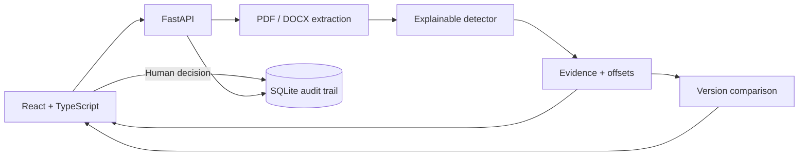

# ClauseScope

> Evidence-first contract review: detect, compare, verify, decide.

[](https://github.com/eviadev/clause-scope/actions/workflows/ci.yml)

ClauseScope turns synthetic PDF and DOCX contracts into inspectable review evidence. Every detected clause points back to an exact extract, page or section, character offsets, and confidence. Reviewers can compare two versions, approve an analysis, or request changes in an append-only decision journal.

The current engine is deliberately an explainable heuristic baseline. It is not presented as a legal AI oracle: future NLP or LLM strategies must preserve the same evidence contract and pass the same evaluation interface.

## Why it is different

- **Evidence before labels** — results retain exact source text and location.
- **Contract diff** — added, removed, modified, and unchanged clauses are explicit.
- **Human review** — approvals and change requests record reviewer, comment, and timestamp.
- **Synthetic one-click demo** — generated DOCX files exercise the full comparison path without personal data.
- **Measurable failures** — evaluation reports global and per-clause metrics plus case-level errors.
- **Privacy-aware defaults** — temporary uploads are deleted and no credentials are bundled.

## Product flow

1. Create a review matter or open the comparison workspace.
2. Upload test PDF/DOCX files, or load the synthetic before/after demo.
3. Inspect each finding with its evidence, location, and confidence.
4. Compare versions to focus attention on changed obligations.
5. Approve the analysis or request a correction; the decision joins the audit trail.

## Architecture



The detector is isolated behind typed result models. Replacing it with a learned strategy does not change the API for evidence, comparison, review decisions, or evaluation.

## Verified state

| Check | Result |
| --- | ---: |
| Backend tests | 18 passing |
| Frontend tests | 30 passing |
| Annotated synthetic cases | 14 |
| Synthetic false positives / false negatives | 0 / 0 |
| Synthetic precision / recall / F1 | 1.00 / 1.00 / 1.00 |
| TypeScript and Vite build | validated in CI |

These numbers describe a small synthetic regression corpus only. They do **not** measure performance on real contracts and this software does not provide legal advice.

## Run locally

Requirements: Python 3.11+, Node.js 22+, and optionally Docker Compose.

```bash
cp backend/.env.example backend/.env
docker compose up --build
```

- UI: `http://localhost:3000`
- API: `http://localhost:8000`
- OpenAPI: `http://localhost:8000/docs`

Without Docker:

```bash
make install

cd backend
. venv/bin/activate
python -m uvicorn app:app --reload

cd ../frontend
npm run dev
```

## Verify it

```bash
make test
make evaluate
```

CI runs backend tests, the synthetic quality gate, TypeScript checking, frontend tests, and a production build.

## Main API routes

| Method | Route | Purpose |
| --- | --- | --- |
| `POST` | `/deals` | Create a review matter |
| `POST` | `/deals/{id}/contract` | Analyze a contract with evidence |
| `GET` | `/deals/{id}/results` | Read persisted results |
| `POST` | `/contracts/compare` | Compare two contract versions |
| `GET` | `/demo/contracts/{version}` | Generate a synthetic DOCX demo |
| `POST` | `/deals/{id}/reviews` | Append a human decision |
| `GET` | `/deals/{id}/reviews` | Read the review journal |

## Security boundary

Local development uses `AUTH_MODE=disabled` with synthetic documents. A private demo can enable Basic Auth with unique values supplied outside the repository. Basic Auth is not a production authentication system.

Temporary files are removed, but persisted evidence can contain document extracts. Do not use sensitive contracts in this portfolio build. See [SECURITY.md](SECURITY.md).

## Roadmap

Progress is tracked in [issue #1](https://github.com/eviadev/clause-scope/issues/1):

- expand the corpus with adversarial, multilingual, and layout-diverse cases;
- compare rule, NLP, and LLM strategies on the same evidence contract;
- add calibrated confidence and abstention;
- publish a privacy-safe synthetic demo and short walkthrough.

The architectural rule is documented in [ADR 0001](docs/adr/0001-evidence-before-prediction.md).

## License

MIT
